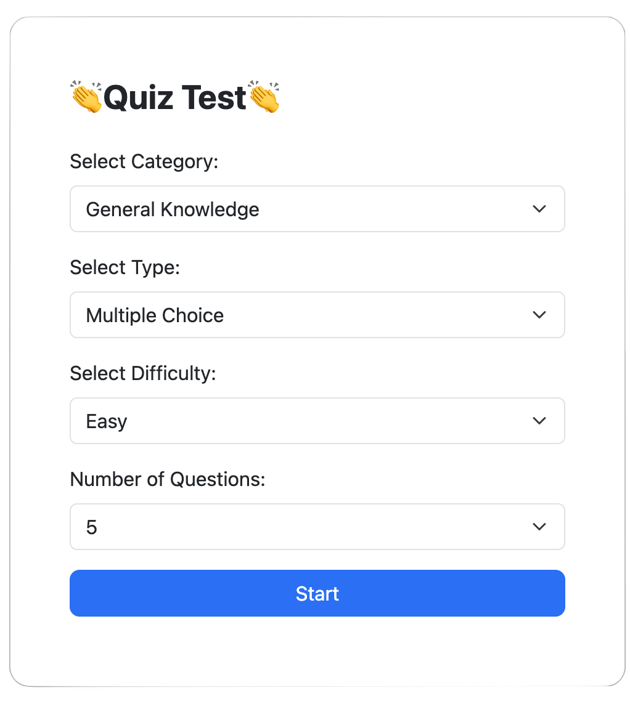
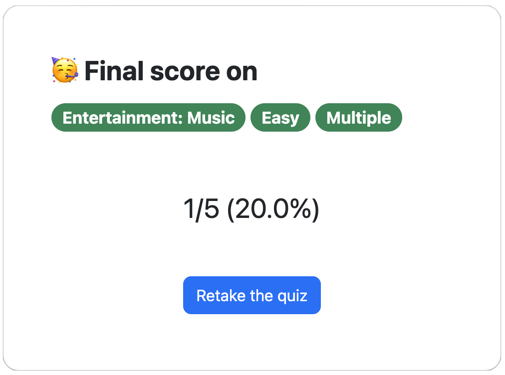
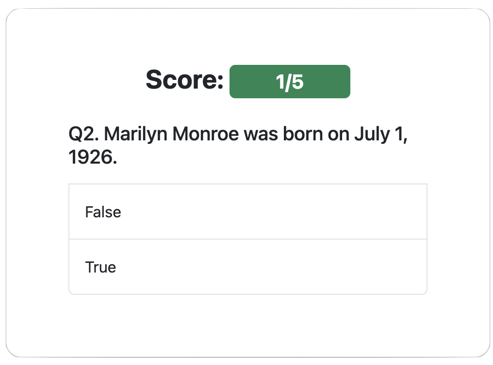

# Quiz Game

This repository contains three versions of a quiz game: text-based, GUI-based, and web-based. Each version provides a unique way to play the quiz game, catering to different user preferences and platforms.

## Versions

1. Text-based Version

   The text-based version of the quiz game allows users to play the game through a command-line interface. This is the easy version with pre-defined quiz questions. Players will be presented with true/false questions and can input their answers using the keyboard. The game will provide immediate feedback on the correctness of each answer and keep track of the player's score. 
   
   

2. GUI-based Version

   The GUI-based version of the quiz game offers a graphical user interface for a more interactive gameplay experience. Users can navigate through the quiz questions using buttons and select their answers by clicking on the options displayed on the screen. The GUI version provides a visually appealing and user-friendly way to play the game.
   
   

3. Web-based Version

   The web-based version of the quiz game allows users to play the game through a web browser. Players can access the game by visiting a specific URL and interact with the quiz using their mouse or touch input. This version offers the flexibility of playing the game on various devices without the need for installation.
   
   
    
    
   
   

## Features

- Multiple-choice questions: The quiz game presents users with a set of questions and provides multiple options to choose from for each question.
- Immediate feedback: After answering each question, players receive instant feedback on whether their answer is correct or not.
- Score tracking: The game keeps track of the player's score throughout the quiz and displays the final score at the end.

## Getting Started

To get started with any version of the quiz game, follow the instructions specific to each version in their respective directories.

- For the text-based version, refer to the [text-based/README.md](./text-based/README.md) file.
- For the GUI-based version, refer to the [gui-based/README.md](./gui-based/README.md) file.
- For the web-based version, refer to the [web-based/README.md](./web-based/README.md) file.

## Acknowledgements

We would like to acknowledge the following resources and libraries used in the development of this quiz game:

- [Open Trivia Database](https://opentdb.com/): support quiz questions.

## Contributing

Contributions to this project are welcome. If you have any ideas, improvements, or bug fixes, please submit a pull request or open an issue with detailed information. Let's make this quiz game even better together!
