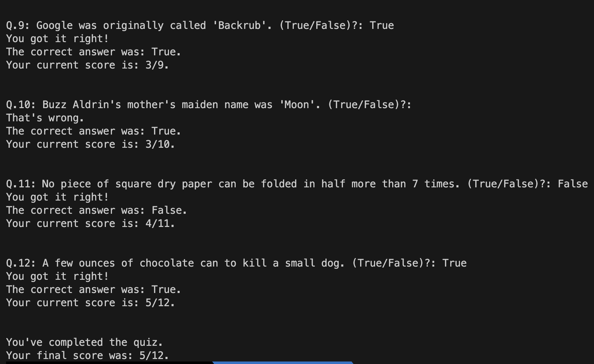

# Text-based Quiz Game

Pre-defined questions are in data.py, you can modified it by yourself.

## Getting Started

To play the text-based version of the quiz game, follow these steps:

1. Clone the repository to your local machine.
2. Navigate to the text-based directory.
3. Run the main.py file using Python.
4. Answer the questions by entering true or false and pressing Enter.
5. Receive immediate feedback on the correctness of your answers and see your final score at the end of the game.

